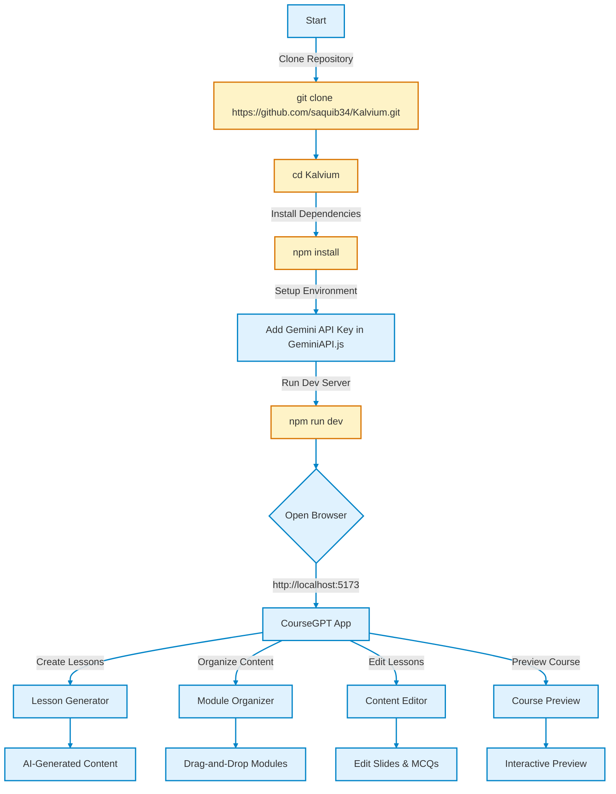

# CourseGPT - AI-Powered Course Builder

Welcome to CourseGPT, an innovative web application built with Vite and React that empowers educators to create engaging, AI-generated educational content effortlessly. With a sleek interface, animated transitions powered by GSAP, and Tailwind CSS styling, CourseGPT streamlines lesson planning, module organization, and course previewing.

## ✨ Features

- **Lesson Generator**: Create lessons with AI-driven content tailored to your topic, audience, and difficulty level.
- **Module Organizer**: Drag-and-drop interface to arrange modules and lessons seamlessly.
- **Content Editor**: Fine-tune lesson details, slides, MCQs, and videos with an intuitive editor.
- **Course Preview**: Interactive preview with slides, quizzes, and video embeds for a student-like experience.
- **Responsive Design**: Fully responsive UI styled with Tailwind CSS, ensuring accessibility on all devices.
- **Smooth Animations**: GSAP-powered transitions for a polished user experience.

## 🛠️ Tech Stack

- **Frontend**: React 18, Vite 5
- **Styling**: Tailwind CSS 3
- **Animations**: GSAP (GreenSock Animation Platform)
- **API Integration**: Gemini API for lesson content generation (replace with your API key)
- **Version Control**: Git, GitHub

## 📦 Project Structure

```
course-app/
├── src/
│   ├── components/
│   │   ├── LessonGenerator.jsx
│   │   ├── ModuleOrganizer.jsx
│   │   ├── ContentEditor.jsx
│   │   ├── CoursePreview.jsx
│   │   ├── Navbar.jsx
│   │   ├── Sidebar.jsx
│   │   ├── GeminiAPI.js
│   │   ├── CourseSlide.jsx
│   │   ├── MCQSection.jsx
│   │   ├── VideoEmbed.jsx
│   │   ├── SummarySection.jsx
│   │   └── AnimatedBackground.jsx
│   ├── App.jsx
│   ├── main.jsx
│   ├── index.css
│   └── assets/
├── index.html
├── package.json
├── vite.config.js
├── tailwind.config.js
├── postcss.config.js
└── README.md
```

## 🚀 Getting Started

Follow these steps to set up and run CourseGPT locally.

### Prerequisites

- Node.js (v18+ recommended): [Download Node.js](https://nodejs.org/)
- Git: [Install Git](https://git-scm.com/downloads)
- A modern browser (Chrome, Firefox, Edge, etc.)
- A text editor (e.g., VS Code)

### Installation

#### Clone the Repository

Clone the project from GitHub to your local machine:

```bash
git clone https://github.com/saquib34/Kalvium.git
```

#### Navigate to the Project Directory

Move into the project folder:

```bash
cd Kalvium
```

#### Install Dependencies

Install all required packages using npm:

```bash
npm install
```

#### Run the Development Server

Start the Vite development server:

```bash
npm run dev
```

Open http://localhost:5173 in your browser to view the app.
The server will hot-reload on code changes.

### Configuration

- **Gemini API Key**: Replace `YOUR_GEMINI_API_KEY` in `src/components/GeminiAPI.js` with your actual API key to enable lesson content generation.
- **Tailwind CSS**: Already configured in `tailwind.config.js` and `index.css`. Add custom styles as needed.

## 🎨 Mermaid Chart: Project Workflow

Below is a Mermaid flowchart visualizing the setup and development workflow for CourseGPT, with animated transitions when viewed in supported platforms (e.g., GitHub Markdown preview with Mermaid support).



### Mermaid Chart Explanation

The Mermaid chart above illustrates the workflow for setting up and using CourseGPT, designed to be both informative and visually engaging:

- **Nodes**:
  - A (Start): The entry point for users.
  - B, C, D, E, F: Action steps (highlighted in amber) for cloning, navigating, installing, configuring, and running the app.
  - G, H: Transition to accessing the app in the browser and interacting with CourseGPT.
  - I, J, K, L: Core features of the app (Lesson Generator, Module Organizer, Content Editor, Course Preview).
  - M, N, O, P: Outcomes of each feature, showing what users achieve.

- **Flow**:
  - The chart follows a top-down sequence for setup (A → F), then branches to browser access (G → H), and finally splits into parallel paths for the app's features (I, J, K, L).
  - Arrows represent the logical progression (e.g., Clone Repository → Navigate to Directory).

- **Styling**:
  - Default Nodes: Light blue fill (#e0f2fe) with dark blue borders (#0284c7) for a clean, modern look.
  - Action Nodes: Amber fill (#fef3c7) with orange borders (#d97706) to highlight user actions.
  - Transitions: Links have a subtle animation (transition:stroke 0.3s) for platforms supporting Mermaid animations.

- **Interactivity**:
  - Clickable nodes (A and H) include placeholder callbacks for potential interactivity in supported Mermaid viewers.
  - The chart is concise yet detailed, guiding users visually through setup and usage.

- **Purpose**:
  - Helps new users understand the project flow at a glance.
  - Highlights key actions and features with distinct colors.
  - Enhances the README with a professional, animated diagram when viewed in Mermaid-compatible environments (e.g., GitHub, VS Code with Mermaid plugins).

## 🧪 Development Notes

- **Environment**: Tested on Node.js v18+, Vite 5.2.8, React 18.2.0.
- **API Dependency**: The Gemini API in GeminiAPI.js requires an active key. Mock responses for testing if no key is available.
- **Animations**: GSAP animations may need adjustment for performance on low-end devices.

## 🤝 Contributing

Contributions are welcome! To contribute:

1. Fork the repository.
2. Create a new branch (`git checkout -b feature-name`).
3. Commit changes (`git commit -m "Add feature"`).
4. Push to the branch (`git push origin feature-name`).
5. Open a Pull Request.

## 📜 License

This project is licensed under the MIT License. See the LICENSE file for details.

## 📬 Contact

For questions or feedback, reach out via GitHub Issues or contact the maintainer at saquib34@example.com.